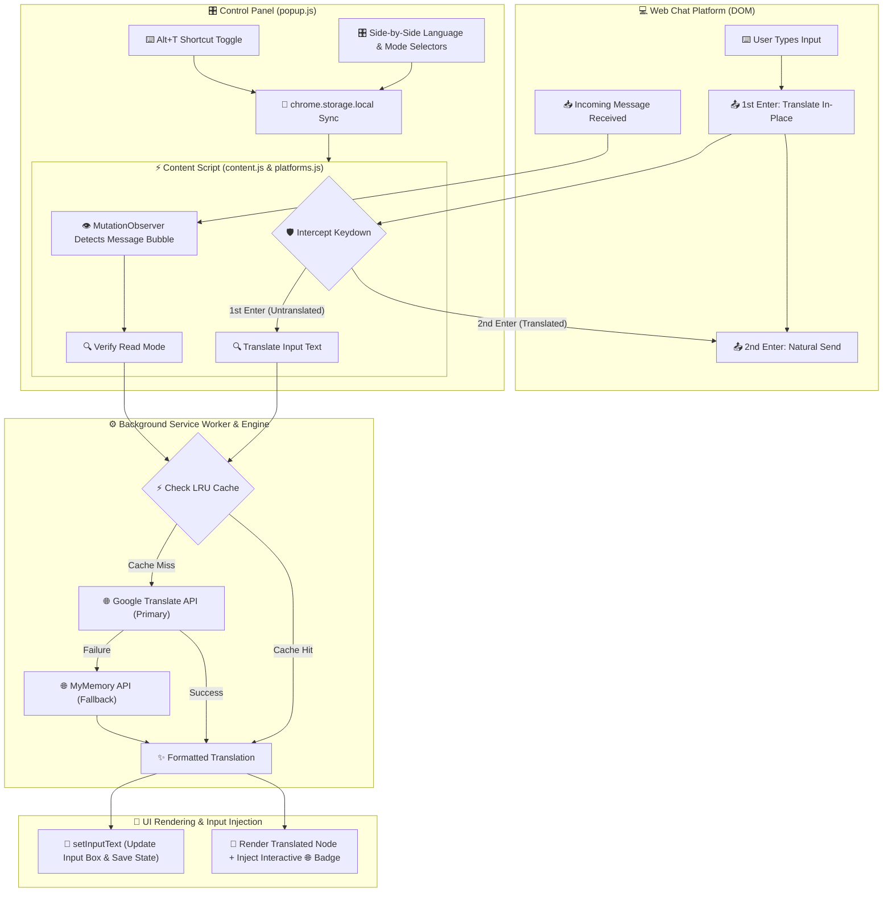

# TransNova — Chat Translator

<div align="center">


**Universal All-Language Real-Time Web Chat Translator**

Type in your native language, send in any target language. Auto-detect incoming messages from any language and read in your preferred primary language. Works seamlessly across web chat apps (WhatsApp Web, Telegram Web, Discord Web, Slack Web, Messenger Web, Snapchat Web).

[](#installation)
[](#)
[](#)
[](#license)

</div>

---

## ✨ Key Features

| Feature | Description |
|---|---|
| 🌍 **Universal Multi-Language Support** | Supports 30+ major languages sorted alphabetically (A to Z), including dedicated **Hinglish** (`hi-Latn`) & **Bhojpuri** (`bho`) |
| ⌨️ **2-Step Enter Translation** | Press **`Enter` once** to translate in-place in the input box; press **`Enter` a second time** to send |
| 🌐 **Dual Engine Translation** | Powered by **Google Translate API** with **MyMemory API** fallback for high-accuracy auto-detection and natural translation |
| 🚩 **Mini Country Flags** | Crisp mini country flag icons rendered alongside every language selector |
| 🎛️ **Side-by-Side Controls** | Compact side-by-side primary & partner language selection with 1-click horizontal swap (`⇆`) |
| 📤 **Outgoing Translation** | Type in your primary language — automatically translated into your partner's target language |
| 📥 **Incoming Auto-Detection** | Incoming messages in any language are automatically detected and rendered in your primary language |
| ⚡ **Multi-Layer LRU Caching** | High-performance dual-tier caching (Content Script + Service Worker) avoids redundant API calls |
| 💬 **Interactive Original Text Badge** | Click the `🌐` badge on any translated message bubble to toggle between original and translated text |
| ⌨️ **Keyboard Shortcut** | Press `Alt + T` at any time to instantly toggle extension translation on/off |
| 🛡️ **Context Invalidation Guard** | Detects extension reloads/updates gracefully, showing clear toast guidance (`F5` refresh) without breaking chat input |

---

## 📸 How It Works

```
You type text (e.g. "kaise ho") ──► Press Enter (1st) ──► Input translated ("How are you") ──► Press Enter (2nd) ──► Recipient receives translation
                                           ↕
Sender writes in any language  ──► Intercepted & Auto-Detected ──► You view in your Primary Language
```

---

## 🔄 Application Workflow Chart



---

## 🎛️ Translation Modes

TransNova features **independent controls** for outgoing and incoming messages:

### Outgoing Messages (Send)

| Setting | Your Input | Result on 1st Enter | Result on 2nd Enter |
|---|---|---|---|
| **Original (Off)** | Text sent as typed | Sent immediately as typed | Sent immediately as typed |
| **Translate Outgoing** | *"kya kar rahe ho"* | Text becomes *"What are you doing"* in input box | Sent to chat recipient |

### Incoming Messages (Read)

| Setting | Sender's Input | Your View |
|---|---|---|
| **Original (Off)** | Messages displayed as received | Original text |
| **Translate Incoming** | Incoming message in any language | Rendered in your primary language + `🌐` Toggle Badge |

---

## 🚀 Installation

### From Source (Developer Mode)

1. **Clone or download** this repository:
   ```bash
   git clone https://github.com/SINGH0883/TransNova.git
   ```

2. Open **Google Chrome** and navigate to:
   ```
   chrome://extensions
   ```

3. Enable **Developer mode** (toggle switch in the top-right corner).

4. Click **Load unpacked**.

5. Select the `TransNova` project directory.

6. The TransNova icon will appear in your Chrome toolbar 🎉

---

## 🎯 Usage

### Getting Started

1. Open any supported web chat app (e.g., [WhatsApp Web](https://web.whatsapp.com), [Telegram Web](https://web.telegram.org), [Discord](https://discord.com), [Slack](https://app.slack.com), [Messenger](https://www.messenger.com), [Snapchat Web](https://web.snapchat.com)).
2. Look for the **TransNova AI** toast notification in the bottom-right corner.
3. Click the **TransNova icon** in your toolbar to open the compact dark control panel.
4. Select **My Language** and **Partner Language**, and set **Outgoing (Send)** and **Incoming (Read)** modes.

### 2-Step Enter Key Workflow

- **Press `Enter` once**: Translates your input in-place inside the chat text box so you can review or edit it.
- **Press `Enter` a second time**: Sends the translated message.

### Quick Shortcut Toggle

Press **`Alt + T`** to instantly pause or resume translation across all tabs without opening the popup.

### Viewing Original Text

Every incoming translated message features a `🌐` badge. **Click it** to toggle between the original message and the translation.

---

## 🏗️ Project Structure

```
TransNova/
├── manifest.json               # Chrome Extension Manifest (V3)
├── LICENSE                     # MIT License documentation
├── README.md                   # Complete documentation
├── icons/                      # Extension branding & toolbar icons
│   ├── icon16.png
│   ├── icon32.png
│   ├── icon48.png
│   ├── icon128.png
│   └── icon256.png
├── lib/
│   └── platforms.js            # Platform selectors & Lexical/DOM input adapter engine
├── background/
│   └── service-worker.js       # Background relay, Google/MyMemory APIs, Hinglish transliteration, settings sync
├── content/
│   ├── content.js              # Interceptor, MutationObserver, 2-step Enter handler & context protection
│   └── content.css             # Glassmorphism toasts, indicators, loading spinners & badges
└── popup/
    ├── popup.html              # Compact dark popup interface with side-by-side selectors & mini flags
    ├── popup.css               # Modern high-contrast typography & flat dark layout
    └── popup.js                # Popup controller, flag updates & tab detection
```

---

## 🛠️ Supported Platforms

| Platform | Status | Features Supported |
|---|---|---|
| **WhatsApp Web** | ✅ Fully Supported | Lexical AST input replacement, message bubble translation, badges |
| **Telegram Web** | ✅ Fully Supported | WebK & WebZ interfaces, input interception & incoming translation |
| **Discord Web** | ✅ Fully Supported | Text channels, DMs, contenteditable input replacement |
| **Slack Web** | ✅ Fully Supported | Workspace channels & direct messages |
| **Messenger / Facebook** | ✅ Fully Supported | Chat threads & popup conversation bubbles |
| **Snapchat Web** | ✅ Fully Supported | Real-time chat history & slate/contenteditable input interception |

---

## 🔑 Keyboard Shortcuts

| Shortcut | Action | Scope |
|---|---|---|
| `Alt + T` | Toggle translation ON / PAUSED | Global across all web chat tabs |

---

## 📄 License

This project is licensed under the MIT License — see the [LICENSE](LICENSE) file for details.

---

<div align="center">

**Developed with ❤️ by Yuvraj**

*TransNova — Breaking language barriers across the web, one chat at a time.*

</div>
