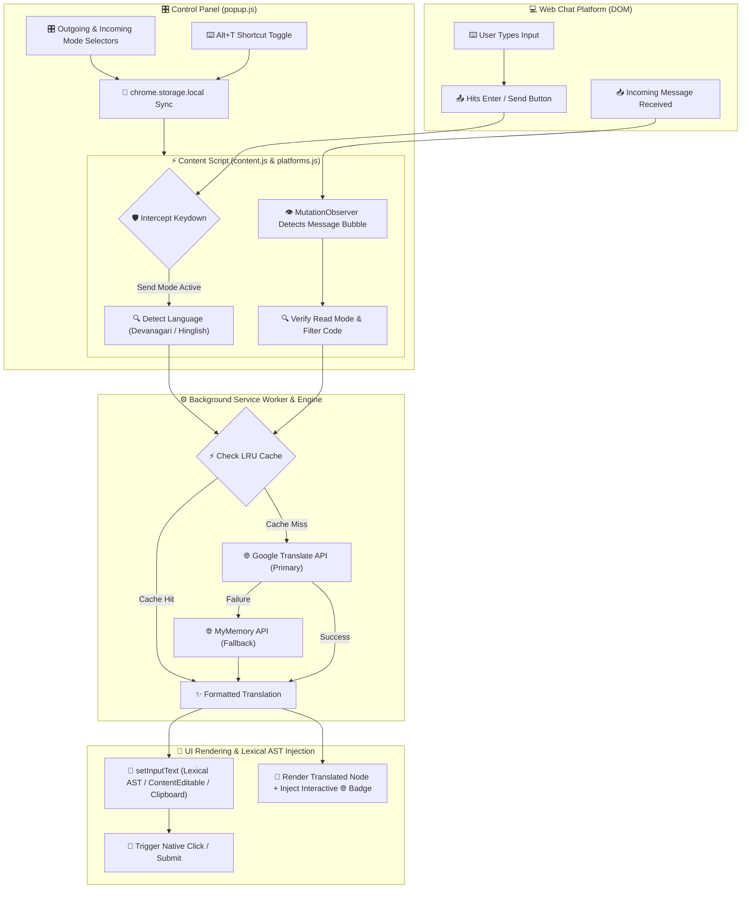

# TransNova — Universal Hindi ↔ English Web Chat Translator

<div align="center">


**Real-time Hindi ↔ English AI Translation for Web Chat Platforms**

Type in Hindi, send in English. Receive in English, read in Hindi. Works seamlessly across supported web chat apps like WhatsApp Web, Telegram Web, Discord Web, Slack Web, Messenger Web, and Snapchat Web.

[](#installation)
[](#)
[](#)
[](#license)

</div>

---

## ✨ Features

| Feature | Description |
|---|---|
| 🌐 **Dual Engine Translation** | Powered by **Google Translate API** (primary engine for instant auto-detection & Hinglish) with **MyMemory API** fallback |
| 🎛️ **Independent Send & Read Controls** | Configure outgoing translation (Send in English/Hindi) and incoming translation (Read in Hindi/English) separately |
| 🇮🇳 → 🇬🇧 **Hindi to English** | Type in Devanagari Hindi or Hinglish — automatically translated to English before sending |
| 🇬🇧 → 🇮🇳 **English to Hindi** | Incoming English messages are automatically rendered in Hindi |
| 🔀 **Romanized Hinglish Support** | Detects and translates Romanized Hindi (*"kya haal hai", "kaise ho bhai"*) as accurately as Devanagari script (*"क्या हाल है"*) |
| ⌨️ **Keyboard Shortcut** | Press `Alt + T` at any time to instantly toggle extension translation on/off |
| 💬 **Interactive Original Text Badge** | Click the `🌐` badge on any translated message bubble to toggle between original and translated text |
| ⚡ **Multi-Layer LRU Caching** | High-performance dual-tier caching (Content Script + Service Worker) avoids redundant API calls |
| 🛡️ **Context Invalidation Guard** | Detects extension reloads/updates gracefully, showing clear toast guidance (`F5` refresh) without breaking chat input |
| 📍 **Floating Status Indicator** | Non-intrusive floating badge on active chat tabs showing your current translation configuration |

---

## 📸 How It Works

```
You type Hindi/Hinglish ──► Intercepted & Translated ──► Recipient receives English
                                   ↕
Sender writes English   ──► Intercepted & Translated ──► You view in Hindi
```

---

## 🔄 Application Workflow Chart



### Detailed Execution Flow

1. **Initialization**: On tab load, `content.js` calls `TransNovaPlatforms.detectPlatform()` to check host permissions and bind to active adapters (WhatsApp Web, Telegram, Discord, Slack, Messenger).
2. **Outgoing Interception & Lexical AST Injection**:
   - User types in Hindi/Hinglish and hits `Enter`.
   - `handleKeyDown` in `content.js` intercepts the event, verifies configured `sendMode`, and sends a `TRANSLATE` message to `service-worker.js`.
   - Service worker queries Google Translate API (with MyMemory fallback) and caches the response.
   - `setInputText()` cleanly clears the target input container using native selection/range manipulation (`execCommand`, Lexical AST updates, ClipboardEvent paste fallback) and triggers a simulated submit click.
3. **Incoming Observation & Interactive Badging**:
   - `MutationObserver` monitors real-time DOM changes for incoming message rows.
   - Extracts text content, filters out code snippets/URLs, and fetches Hindi/English translation.
   - Injects a `transnova-loading` spinner during fetch, followed by a `transnova-badge` (`🌐`).
   - Clicking the badge toggles between original and translated text on the fly.
4. **Resilience & Tab Synchronization**:
   - `sendMessageSafe()` guards against Chrome Extension Context Invalidation (e.g. when updating the extension while tabs are open), notifying users to refresh with a toast instead of crashing inputs.
   - Popup state changes sync live across all active tabs via `chrome.storage.local` and background broadcast messages.

---

## 🎛️ Translation Modes

TransNova features **independent controls** for outgoing and incoming messages:

### Outgoing Messages (Send)

| Setting | Your Input | Recipient Sees |
|---|---|---|
| **Original (Off)** | Text sent as typed | Original text |
| **Send in English** (`en`) | Hindi or Hinglish (*"kya kar rahe ho"*) | English (*"What are you doing"*) |
| **Send in Hindi** (`hi`) | English (*"Where are you going?"*) | Devanagari Hindi (*"आप कहाँ जा रहे हैं?"*) |

### Incoming Messages (Read)

| Setting | Sender's Input | Your View |
|---|---|---|
| **Original (Off)** | Messages displayed as received | Original text |
| **Read in Hindi** (`hi`) | Incoming English (*"Let's meet tomorrow"*) | Devanagari Hindi (*"चलिए कल मिलते हैं"*) + `🌐` Badge |
| **Read in English** (`en`) | Incoming Hindi (*"आप कैसे हैं"*) | English (*"How are you"*) + `🌐` Badge |

---

## 🚀 Installation

### From Source (Developer Mode)

1. **Clone or download** this repository:
   ```bash
   git clone https://github.com/SINGH0883/TransNova.git
   ```

2. Open **Google Chrome** and navigate to:
   ```
   chrome://extensions
   ```

3. Enable **Developer mode** (toggle switch in the top-right corner).

4. Click **Load unpacked**.

5. Select the `TransNova` project directory.

6. The TransNova icon will appear in your Chrome toolbar 🎉

---

## 🎯 Usage

### Getting Started

1. Open any supported web chat app (e.g., [WhatsApp Web](https://web.whatsapp.com), [Telegram Web](https://web.telegram.org), [Discord](https://discord.com), [Slack](https://app.slack.com), [Messenger](https://www.messenger.com), [Snapchat Web](https://web.snapchat.com)).
2. Look for the **"TransNova Universal"** toast notification in the bottom-right corner.
3. Click the **TransNova icon** in your toolbar to open the glassmorphism control panel.
4. Set your preferred **Outgoing (Send)** and **Incoming (Read)** modes.

### Quick Shortcut Toggle

Press **`Alt + T`** to instantly pause or resume translation across all tabs without opening the popup.

### Viewing Original Text

Every incoming translated message features a `🌐` badge. **Click it** to toggle between the original message and the translation.

---

## 🏗️ Project Structure

```
TransNova/
├── manifest.json               # Chrome Extension Manifest (V3)
├── LICENSE                     # MIT License documentation
├── README.md                   # Complete documentation
├── icons/                      # Extension branding & toolbar icons
│   ├── icon16.png
│   ├── icon32.png
│   ├── icon48.png
│   ├── icon128.png
│   └── icon256.png
├── lib/
│   ├── translator.js           # Hinglish dictionary, language detector & LRU cache
│   └── platforms.js            # Platform selectors & Lexical/DOM input adapter engine
├── background/
│   └── service-worker.js       # Background relay, Google/MyMemory APIs, settings sync
├── content/
│   ├── content.js              # Interceptor, MutationObserver, toast & context protection
│   └── content.css             # Glassmorphism toasts, indicators, loading spinners & badges
├── popup/
│   ├── popup.html              # Dark glassmorphism popup interface
│   ├── popup.css               # Modern typography & glow effects
│   └── popup.js                # Popup controller & tab detection
└── debug/
    └── diagnose.js             # Automated in-browser diagnostic tool
```

---

## 🛠️ Supported Platforms

| Platform | Status | Features Supported |
|---|---|---|
| **WhatsApp Web** | ✅ Fully Supported | Lexical AST input replacement, message bubble translation, badges |
| **Telegram Web** | ✅ Fully Supported | WebK & WebZ interfaces, input interception & incoming translation |
| **Discord Web** | ✅ Fully Supported | Text channels, DMs, contenteditable input replacement |
| **Slack Web** | ✅ Fully Supported | Workspace channels & direct messages |
| **Messenger / Facebook** | ✅ Fully Supported | Chat threads & popup conversation bubbles |
| **Snapchat Web** | ✅ Fully Supported | Real-time chat history & slate/contenteditable input interception |

---

## 🔑 Keyboard Shortcuts

| Shortcut | Action | Scope |
|---|---|---|
| `Alt + T` | Toggle translation ON / PAUSED | Global across all web chat tabs |

*You can customize shortcut bindings at `chrome://extensions/shortcuts`.*

---

## 🐛 Diagnostics & Troubleshooting

### Using the Built-In Diagnostic Tool

If translation isn't working on a chat platform:

1. Open your web chat platform (e.g. WhatsApp Web).
2. Press `F12` (or Right-Click ➔ Inspect) and open the **Console** tab.
3. Open [`debug/diagnose.js`](file:///d:/CODE%20TUTORIAL/TransNova/debug/diagnose.js), copy its entire contents, paste it into the console, and hit `Enter`.
4. The diagnostic tool will test DOM selectors, content script globals, Chrome extension APIs, and network connectivity, providing a detailed health report.

### Extension Updated / Context Invalidated?

If you update or reload the extension while chat tabs are open, TransNova displays a **"Please refresh tab (F5) to reconnect"** toast notification. Refreshing the tab restores live messaging interception.

---

## 🤝 Contributing

Contributions are welcome! To contribute:

1. **Fork** this repository.
2. **Create** a feature branch: `git checkout -b feature/new-adapter`
3. **Commit** your changes: `git commit -m "Add adapter for new chat platform"`
4. **Push** to the branch: `git push origin feature/new-adapter`
5. **Open** a Pull Request.

---

## 📄 License

This project is licensed under the MIT License — see the [LICENSE](LICENSE) file for details.

---

<div align="center">

**Developed with ❤️ by Yuvraj Singh**

*TransNova — Breaking language barriers across the web, one chat at a time.*

</div>

